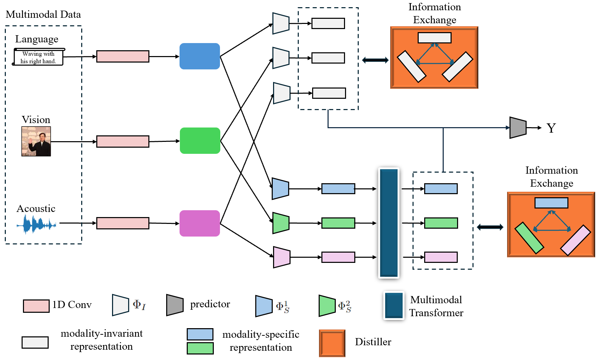

# Multimodal Disentangled Representation Learning Model

## Introduction
We develop a multimodal representation learning model based on disentanglement. The representation of each modality is disentangled into two distinct components: modality-invariant contains shared information across different modalities, and modality-specific retains the unique characteristics of each modality

## Model Architecture

Our model processes inputs from three different modalities—language, vision, and acoustic—each through its respective processing pipeline. The architecture is designed to extract both shared and unique features, facilitating deep understanding and interaction between the modalities.

### Input Modalities
- **Language**: Processes textual data (e.g., "Waving with his right hand.") using a 1D convolutional layer.
- **Vision**: Handles image data with a dedicated 1D convolutional layer.
- **Acoustic**: Processes audio signals through its specific 1D convolutional pathway.

### Feature Representation
The outputs of the initial convolutional layers are split into two distinct streams for each modality:
- **Modality-Invariant Representation**: Captures and consolidates features common across all input types.
- **Modality-Specific Representation**: Focuses on extracting and preserving unique features from each modality.

### Information Exchange Mechanisms
- **Distiller**: Enhances the interaction between the modality-specific and invariant representations, optimizing the information flow and feature refinement.
- **Multimodal Transformer**: Integrates the outputs of all modalities, further synthesizing the data into a cohesive output.

### Output Prediction
The final stage of the model uses a predictor that takes the integrated representation from the multimodal transformer to produce the outcome \( Y \), representing the model's comprehensive response to the multimodal inputs.

